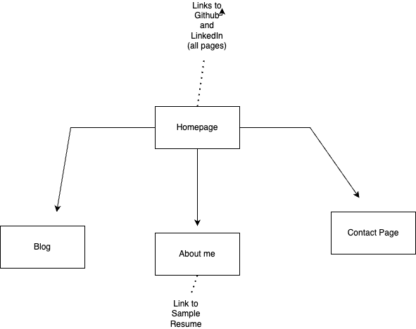
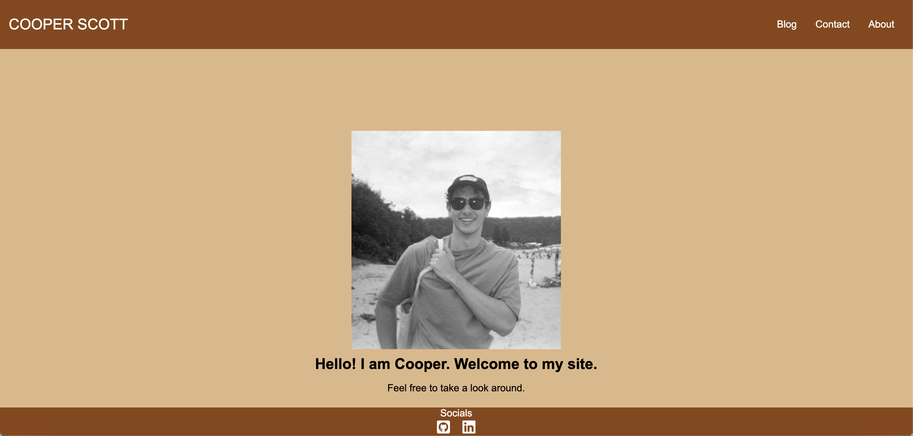
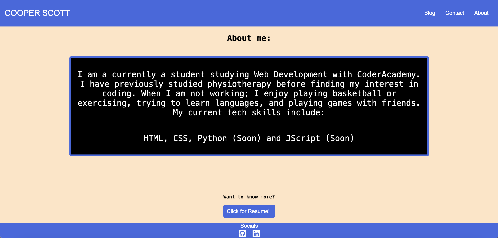
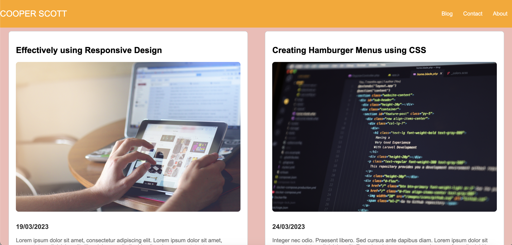

# My Portfolio

## My URL Link to my site:
https://cooper-scott-portfolio.netlify.app

## My link to my GitHub Repo:
https://github.com/CoopersProjects/myportfolio

## My link to my presentation video:
...

## Overview and Description

My portfilio/site's goal is to display my skills as well as a way to contact me and grab the viewer's attention. 

### General Documentation

I started my page with the homepage, working on a footer and a header that can be used across all pages. 

Once complete I started working on the main aspect of the homepage.
I then moved my footer and header into a separate file and imported it into all my other files. 

Once that happened, I overrid the colour choices to change each page before working on the main body. 
I worked on the about page first and its responsiveness. After figuring out the responsive design features I could move on to the rest.

I moved to the contact page where I created a form and a submit button, after trying to make it responsive, I had to move away from my original wireframe design in order to make it work, I kept the colour scheme the same but I had to change the layout for smaller devices to fit everything in. 

Lastly I worked on the blog page, which was the hardest to make responsive, which again lead to straying from the original design of general horizontal rows into something harder to create, in order for a better view on smaller devices. 

Deploying the website was also harder than expected, as my index.html file was not in the root folder to begin with, so I had to move everything around to make it work, asking for help as I was lost as to what the issue was. 

### Functions and Features

In order to achieve this goal, I have used a bunch of features and functions. 

On each page, I have included an interactive footer and header. In the header there is a logo at the top left which is hyperlinked to take you to the main page. On the right, I have a responsive navbar that changes into a hamburger menu when the device is smaller. As for the footer, I have my socials linked by icons down the bottom in the centre of the page.

On the index page, I have a photo of myself as well as a welcome message. 

On the about page, I have a box that has information about me, as well as an interactive feature to know more by having a colour changing button that is linked to a mock resume.

On the blog page, I have 5 blog posts each with a photo, text (lorem ipsum), a publish date and a link to read more, however this link just links back to the same page.

On the contact page, I have an interactive form to contact me, with a larger text area to submit a question as well as a graphic submit button, which changes colour upon hover. 

### Sitemap

### Screenshots of Site

### Target Audience

My target audience for this page is a future employer, the only difference being, that if it was the real deal I would include my actual resume and write more about myself. 

### Tech Stack

My tech stack for this portfolio was just HTML, standard CSS, Netlify for deployment and AwesomeFont for icons.

